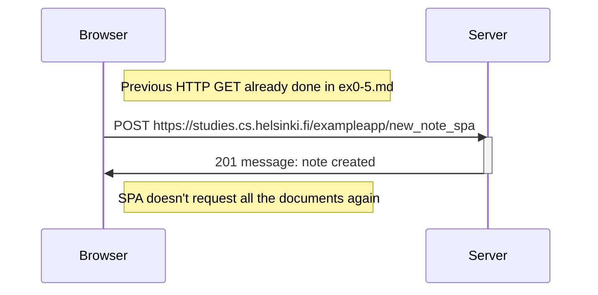

```mermaid
    sequenceDiagram;
    participant Browser;
    participant Server;

    Note right of Browser: Previous HTTP GET already done in ex0-5.md;

    Browser->>Server: POST https://studies.cs.helsinki.fi/exampleapp/new_note_spa;

    activate Server;
    Server->>Browser: 201 message: note created;
    deactivate Server;

    Note right of Browser: SPA doesn't request all the documents again;
```